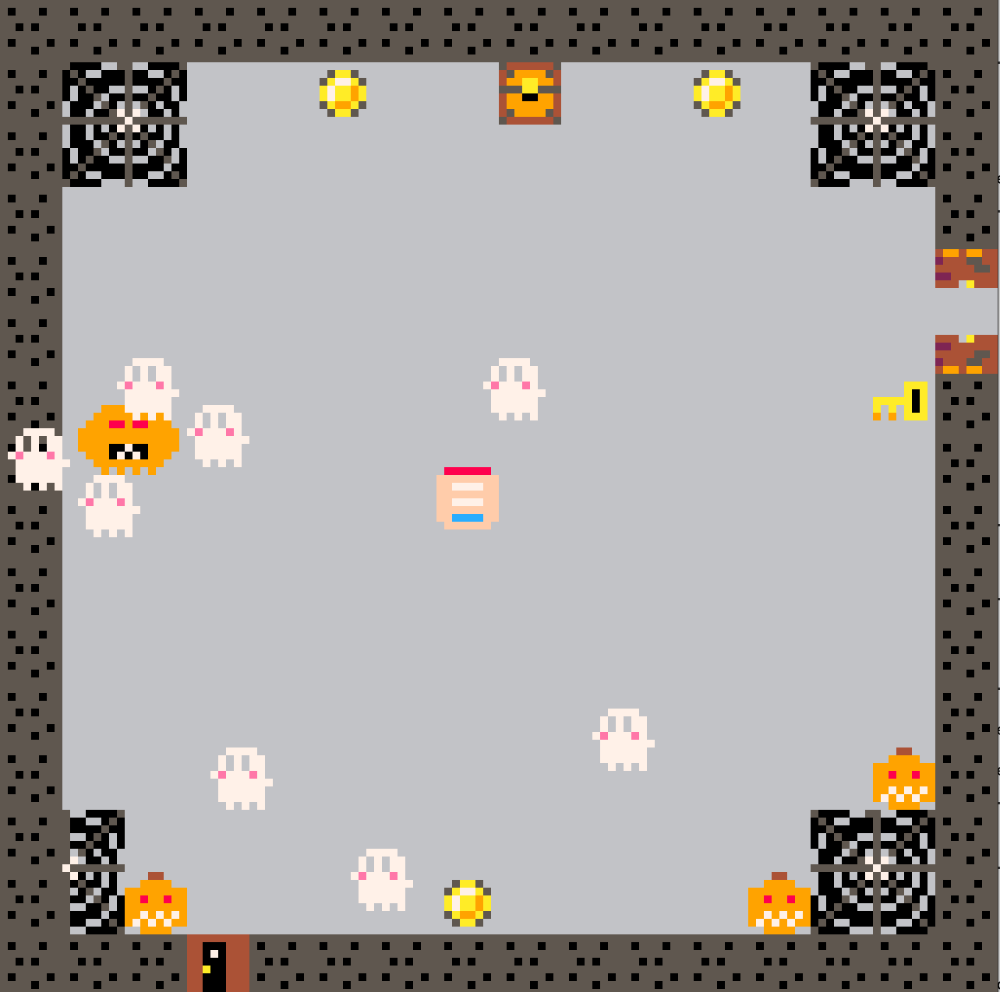

# Pico 8 Thumb Game

This was my first project, building a game in lua using the Pico 8 Interface. 
A thumb need to find his hand, for that he needs to fight ghosts by throwing swords and find keys to open doors.  

You will need __Pico8__ engine to run the game then enter the following command : 
`load main.p8` 
`run main.p8`

Have Fun

